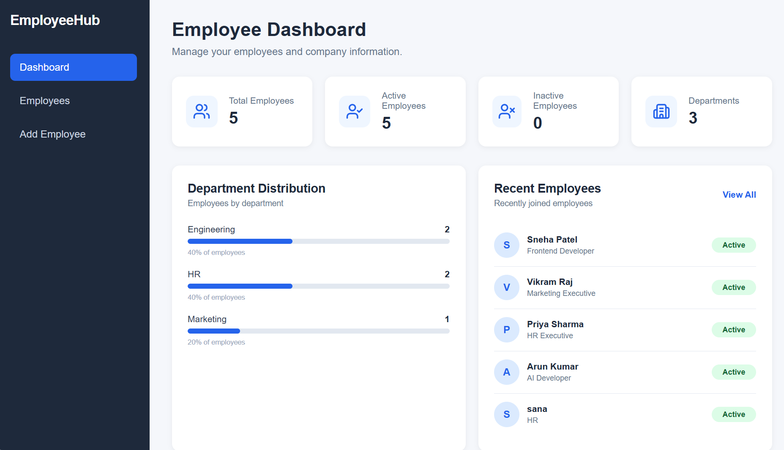
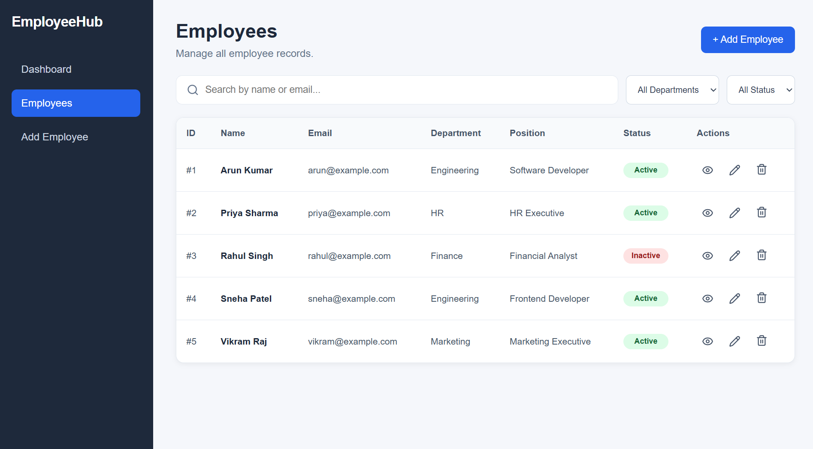
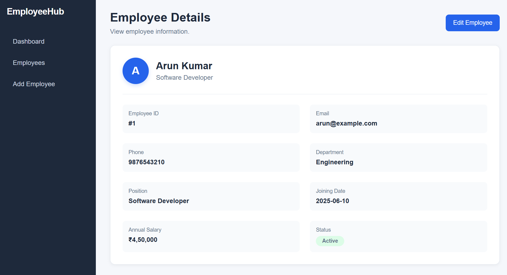
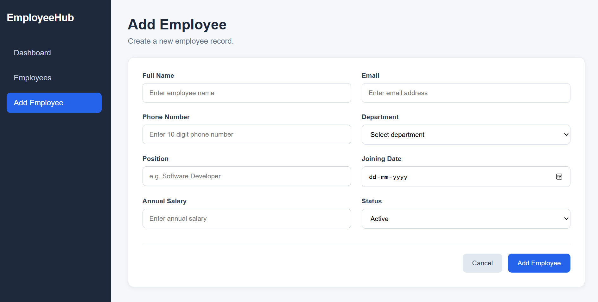

# Employee Management Dashboard

A responsive employee management dashboard built with React, TypeScript, and REST API integration. The application supports complete CRUD operations for managing employee records.

## 🔗 Live Demo

[View Live Demo](https://employee-management-dashboard-572d-okvbh4lic.vercel.app/)

## 🔗 Backend API

[Employee Management API](https://employee-management-api-lq0g.onrender.com/)

## 📸 Screenshots

### Dashboard



### Employees



### Employee Details



### Add Employee



## ✨ Features

- 📊 Employee dashboard with statistics
- 👥 Employee management
- 🔍 Search employees by name or email
- 🏢 Filter employees by department
- 🟢 Filter employees by status
- ➕ Add new employees
- 👁️ View employee details
- ✏️ Edit employee information
- 🗑️ Delete employees
- 🔄 REST API integration
- 📱 Responsive user interface

## 🛠️ Tech Stack

- React
- TypeScript
- Vite
- React Router
- REST API
- JSON Server
- Lucide React
- CSS

## 🔄 CRUD Operations

| Operation | Method | Endpoint |
|---|---|---|
| Get all employees | GET | `/employees` |
| Get employee | GET | `/employees/:id` |
| Add employee | POST | `/employees` |
| Update employee | PUT | `/employees/:id` |
| Delete employee | DELETE | `/employees/:id` |

## 📁 Project Structure

```text
employee-management-dashboard/
│
├── public/
│
├── screenshots/
│   ├── dashboard.png
│   ├── employees.png
│   ├── employee-details.png
│   └── add-employee.png
│
├── src/
│   ├── components/
│   ├── data/
│   ├── pages/
│   ├── services/
│   ├── types/
│   ├── App.tsx
│   ├── App.css
│   └── main.tsx
│
├── db.json
├── package.json
├── tsconfig.json
└── vite.config.ts